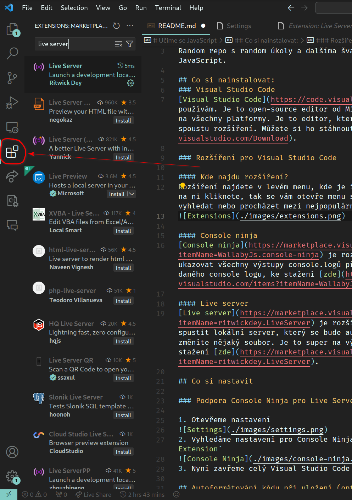
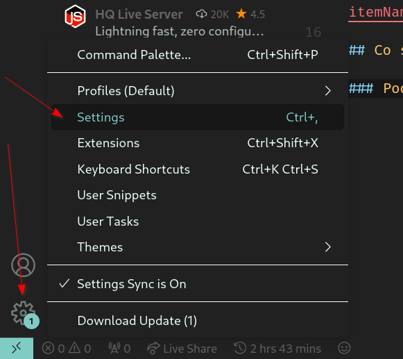
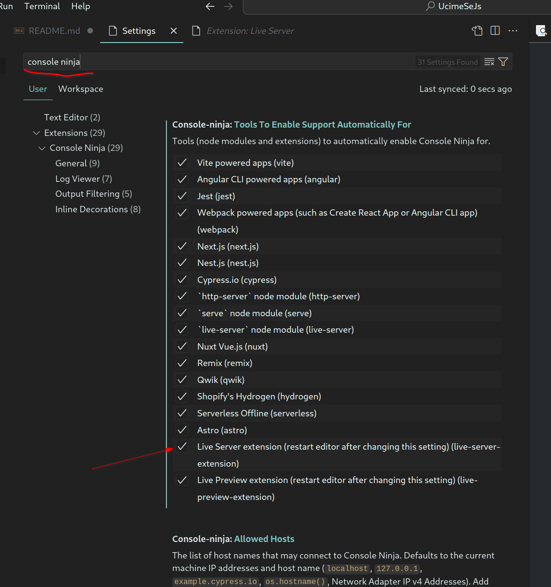
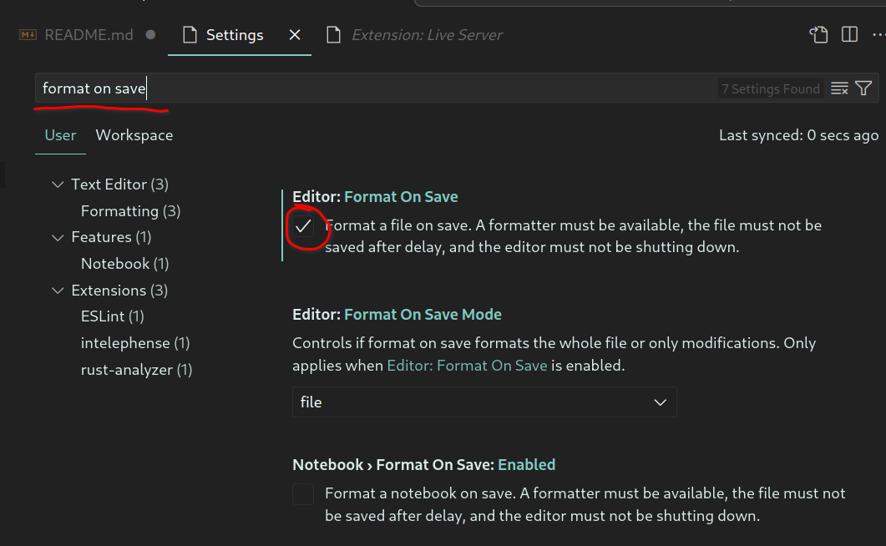
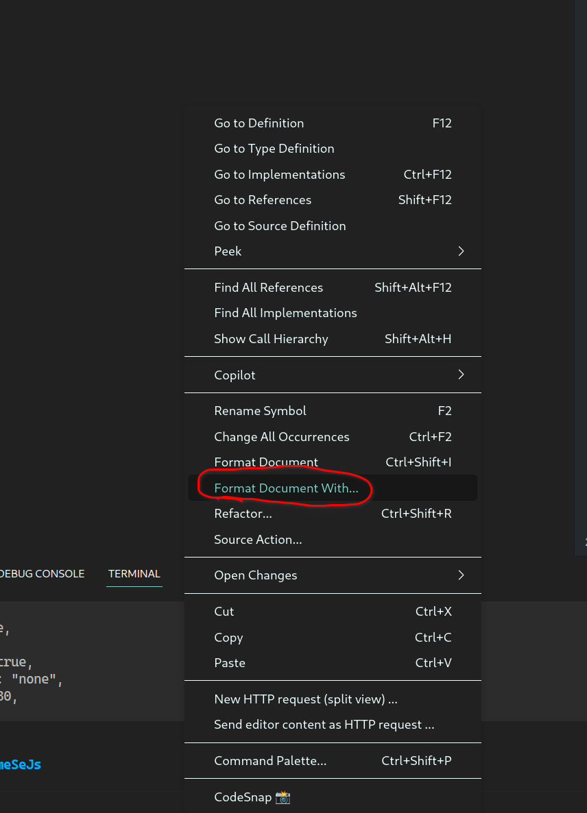
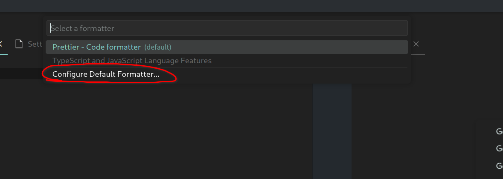
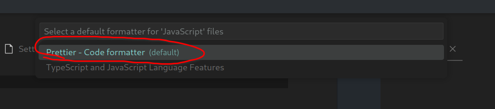
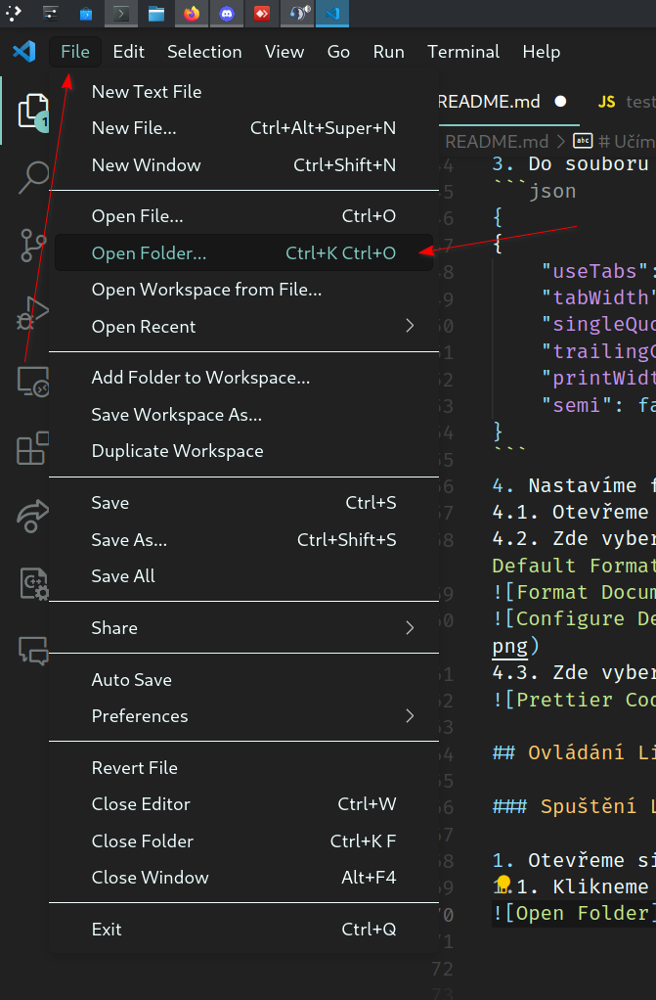
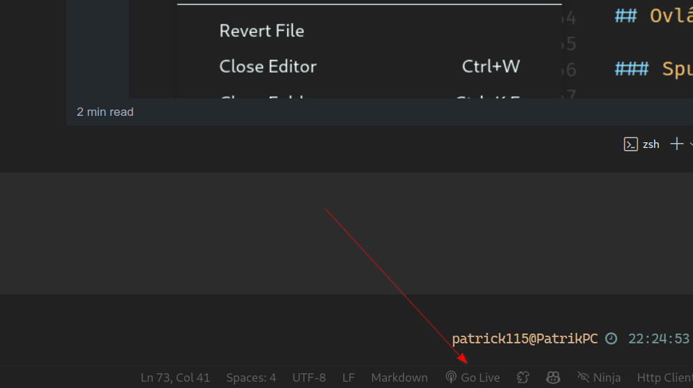

# Učíme se JavaScript

Random repo s random úkoly a dalšíma švandama, když jsem učil někoho JavaScript.

## Co si nainstalovat:
### Visual Studio Code
[Visual Studio Code](https://code.visualstudio.com/) je editor, který používám. Je to open-source editor od Microsoftu, který je dostupný na všechny platformy. Je to editor, který je hodně rozšířený a má spoustu rozšíření. Můžete si ho stáhnout [zde](https://code.visualstudio.com/Download).

### Rozšíření pro Visual Studio Code

#### Kde najdu rozšíření?
Rozšíření najdete v levém menu, kde je ikona s čtyřmi čtverečky. Když na ni kliknete, tak se vám otevře menu s rozšířeními. Můžete si je vyhledat nebo procházet mezi nejpopulárnějšími.


#### Console ninja
[Console ninja](https://marketplace.visualstudio.com/items?itemName=WallabyJs.console-ninja) je rozšíření, které vám bude ukazovat všechny výstupy console.logů přímo v editoru, hned vedle daného console logu, ke stažení [zde](https://marketplace.visualstudio.com/items?itemName=WallabyJs.console-ninja).

#### Live server
[Live server](https://marketplace.visualstudio.com/items?itemName=ritwickdey.LiveServer) je rozšíření, které vám umožní spustit lokální server, který se bude automaticky aktualizovat, když změníte nějaký soubor. Je to super na vývoj webových stránek, ke stažení [zde](https://marketplace.visualstudio.com/items?itemName=ritwickdey.LiveServer).

## Co si nastavit

### Podpora Console Ninja pro Live Server

1. Otevřeme nastavení

2. Vyhledáme nastavení pro Console Ninja a zaškrtneme `Live Server Extension`

3. Nyní zavřeme celý Visual Studio Code a znovu ho otevřeme

## Autoformátování kódu při uložení (optimální)

### 1. Povolení základního autoformátování

1. Otevřeme nastavení

2. Vyhledáme nastavení pro `Format On Save` a zaškrtneme `Editor: Format On Save`


### 2. Jiný formátovací plugin (Prettier) (Optimální)

1. Nainstalujeme si plugin [Prettier](https://marketplace.visualstudio.com/items?itemName=esbenp.prettier-vscode)
2. Vyvoříme si soubor `.prettierrc` v rootu projektu
3. Do souboru `.prettierrc` vložíme následující kód:
```json
{
{
    "useTabs": false,
    "tabWidth": 4,
    "singleQuote": true,
    "trailingComma": "none",
    "printWidth": 180,
    "semi": false
}
```
4. Nastavíme formatter na Prettier
4.1. Otevřeme JS soubor a klikneme pravým tlačítkem myši na editor
4.2. Zde vybereme `Format Document With...` a zvolíme `Configure Default Formatter...`


4.3. Zde vybereme `Prettier - Code formatter`


## Ovládání Live Serveru

### Spuštění Live Serveru

1. Otevřeme si projekt, který chceme spustit
1.1. Klikneme na File -> Open Folder

1.2. Vybereme složku, kterou chceme otevřít
2. Klikneme na ikonu Go Live v pravém dolním rohu

3. Otevře se nám nová záložka v prohlížeči s naší stránkou http://localhost:5500

### Zastavení Live Serveru

1. Klikneme na ikonu Port: 5500 (Místo Go Live) v pravém dolním rohu

2. Live Server se zastaví a mělo by se zde opět objevit Go Live


